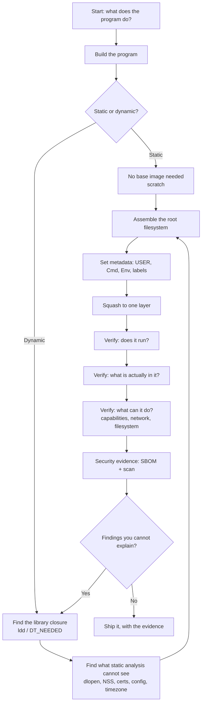

# Method: building a container from scratch

The process this project teaches, in one place. Each tutorial contributes a
piece; this document is where the pieces become something you can follow.

> [!NOTE]
> **In progress.** Sections marked *(pending)* land with the release named
> beside them. What is written here already is drawn from work that has been
> done and verified, not from intent.

## The two ways people build containers

Almost every container is built one of two ways, and the difference is not
style — it changes what the image contains, what breaks, and what a security
scan can tell you.

### The usual way

```dockerfile
FROM some-language:latest
RUN apt-get update && apt-get install -y ...
COPY . .
CMD ["./app"]
```

This works, it is what most documentation shows, and it produces an image
containing an entire distribution: a shell, a package manager, a compiler
toolchain in many cases, and every dependency of every tool that came along for
the ride. Typical result: several hundred megabytes, a few hundred packages,
and a CVE list that never reaches zero because you are shipping an operating
system to run one program.

### The assembled way

You determine exactly what the program needs, put only that in the image, and
build the image from the outside rather than by running commands inside it.
That is what Red Hat does for `ubi9-micro`, and Phase 1 of this project
recovered the evidence: no `RUN` instruction anywhere, a root filesystem
assembled by a package transaction in a *different* container, then copied in.

The rest of this document is the second way.

## The process



The loop from N back to E is the important edge. Every unexplained finding
means the dependency picture is incomplete, not that the scan is wrong.

## Step 1 — Establish what the program actually needs

The question is not "what does my package manager install", it is "what does
this process open at runtime". Those are different sets, and the second is
almost always much smaller.

**Static analysis — what the binary declares.** `scripts/closure.py` reads
`DT_NEEDED` out of the ELF headers and follows it recursively. The classic
tool is `ldd`, which does the same thing by asking the loader:

```sh
ldd ./app
```

Measured example from this project: running `bash` needs **4 files and
5,072,312 bytes** — 22% of `ubi9-micro`. Running `bash` and `coreutils`
together needs 10 files and 7,340,792 bytes.

**What static analysis cannot see.** This is the part that catches people out,
and it is why the flow diagram loops:

| Invisible to `ldd` | Why it matters |
| --- | --- |
| `dlopen` targets | OpenSSL's FIPS provider is loaded this way. The most important component of a FIPS build does not appear in any closure. |
| NSS modules | `getaddrinfo` and `getpwnam` load `libnss_*` by name at call time. Hostname resolution fails in ways that look like a network problem. |
| CA trust bundle | TLS fails with a certificate error, not a missing-file error. |
| Timezone data | The dissection found `ubi9-micro` registers `tzdata` but ships no `/usr/share/zoneinfo`. Everything silently becomes UTC. |
| Config, locale, fonts | Absent until something asks for them. |
| Anything the program shells out to | There is no shell. |

**Dynamic analysis — what the process really opens.** The complement to the
closure, and the only way to find the list above: run the program under
`strace` and record every successful `open`. *(pending — v0.9.0)*

## Step 2 — Decide static or dynamic

Measured in this project, same program, same output:

| | L0.2 static | L1 dynamic |
| --- | ---: | ---: |
| Binary | 939,069 B | 192,632 B |
| Image | 939,069 B | 23,788,574 B |
| Entries in image | 1 | 878 |
| Components an SBOM finds | 0 | 22 |
| Vulnerabilities reported | 0 | 23 |

**The binary got 4.9× smaller and the image got 25× larger.** That is the
trade, stated plainly: dynamic linking moves code out of your binary and onto
the base image, and you then have to carry the base.

Static is not simply better. It cannot `dlopen`, so it cannot do FIPS; NSS and
`getaddrinfo` are unreliable; and a security scanner can see nothing inside it.

## Step 3 — Assemble the filesystem from outside

An image with no shell and no package manager cannot install anything into
itself. Two techniques:

**Install into a directory.** `dnf --installroot=/mnt/rootfs`, then copy the
directory into a `scratch` image. This is what Red Hat does, recovered
verbatim in `docs/FINDINGS.md` (F12).

**Mount the container's filesystem and edit it with host tools.**
`podman unshare` / `podman mount`, or the buildah equivalents. *(pending —
v0.3.0, T4)*

## Step 4 — Verify, in three separate senses

Most people check the first only.

1. **Does it run?** A smoke test. Necessary, and much weaker evidence than it
   feels.
2. **What is actually in it?** Export the filesystem and inspect it —
   `podman export` plus `scripts/verify_image.py`. This works on images with no
   shell, which in-container checks cannot.
3. **What can it do?** Capabilities, network reach, writable paths, whether a
   shell can be spawned. L0.3 measures this; a scan does not.

## Step 5 — Security evidence, and how to read it

`scripts/security_scan.sh` produces an SBOM and a vulnerability scan. The
result needs interpreting, and this is the single most misleading number in
container security:

| Image | Bytes | Components | Vulnerabilities |
| --- | ---: | ---: | --- |
| L0.2 static | 939,069 | 0 | 0 |
| L1 dynamic | 23,788,574 | 22 | 23 |

**The small image is not safer. It is unreadable.** It has no package database,
so a package-based scanner has nothing to inspect. The same libc, with the same
flaws, is compiled into the static binary where no scanner will ever find it.

31.4% of `ubi9-micro` is its rpm database. That is the price of being
auditable.

## Functional differences: what actually breaks

*(expanded through v0.4.0–v0.9.0 as each is met)*

| Symptom | Cause | Where this project meets it |
| --- | --- | --- |
| `error while loading shared libraries: libstdc++.so.6` | The base ships glibc but not libstdc++ | L1 — solved with `-static-libstdc++` |
| Hostname resolution fails | NSS modules absent | v0.4.0 |
| TLS certificate errors | No CA bundle | v0.4.0 |
| Everything is UTC | No `/usr/share/zoneinfo` | v0.9.0 (Java) |
| FIPS provider will not load | Static binary cannot `dlopen` | v0.5.0 |
| `exec /bin/sh` fails | There is no shell | L0.1 |

## Cybersecurity differences

**Attack surface.** No shell means a command-injection bug has nothing to
invoke. No package manager means an attacker cannot install tools. L0.3
measures this rather than asserting it: contained, the same binary could not
spawn a shell, enumerate host processes, or reach the network.

**Capability boundary.** The kernel's own record for a contained process:
`CapEff` and `CapBnd` both zero, `NoNewPrivs: 1`, `Seccomp: 2`. An empty
bounding set means privilege cannot be regained even in principle.

**Scanner visibility, and the paradox.** Minimising the image improves the
first two and destroys the third. An image with zero CVEs launched
`--privileged` is a worse outcome than one with twenty launched
`--cap-drop=ALL`, and only one of those shows up in a report.

**What a scan cannot tell you.** It reads the image. It knows nothing about
how the container is launched — which is where most real-world container
compromise actually lives.

## The disadvantages, honestly

Minimal images cost something, and pretending otherwise makes for bad advice.

| Disadvantage | Why it hurts | Mitigation |
| --- | --- | --- |
| **No shell to debug with** | The usual `exec -it … sh` loop is gone. During an incident this is painful. | A debug sidecar sharing the namespace — *(pending v0.11.0)* |
| **Opaque to scanners** | Static binaries report zero components. Compliance processes that require an SBOM cannot be satisfied from the image. | Generate the SBOM at **build** time from the build inputs and attach it as an attestation, rather than deriving it from the image. |
| **Build-time dependencies are invisible** | The image cannot tell you what it was compiled against. | Record build inputs per rung, as this project does. |
| **Harder to build** | Multi-stage builds, closure analysis, mount-and-edit. More to learn and more to get wrong. | The checklist above; and accept that not every workload justifies it. |
| **Drift between builder and runtime** | The builder has a compiler and the runtime does not, so "works in the build stage" proves little. | Test the runtime image, never the builder. Every rung here does. |
| **Missing files fail confusingly** | An absent CA bundle looks like a network fault; absent tzdata looks like a bug in your date handling. | The functional-differences table above, and dynamic tracing. |
| **Incident response is harder** | No `ps`, no `ls`, nothing to look at. | `podman export` the running container's filesystem for offline analysis, and design a diagnostic mode into the application — as L0.1 and L0.2 do with `--report`. |

## Sidecars: getting debuggability back

*(pending — v0.11.0)*

The answer to "there is no shell in my container" is not to put a shell in it.
It is to attach one temporarily, from outside, when you need it:

- **A debug sidecar** shares the target's namespaces, bringing its own tools.
  The runtime image stays minimal; the debugging capability is added only when
  something is wrong, and removed after.
- Needs `SYS_PTRACE` to inspect another process — a capability that belongs on
  a short-lived sidecar and never on a runtime image.
- Kubernetes has this as ephemeral containers (`kubectl debug`); Podman via
  `--pid=container:<id>` and friends.

The tutorial will build one and use it against an L0 image that has no shell at
all.

## The checklist

*(consolidated at v1.0.0; this is the working version)*

- [ ] Do I know what the program opens at runtime, not just what it links?
- [ ] Have I checked for `dlopen`, NSS, certificates, timezone and config?
- [ ] Static or dynamic — and have I measured both rather than assumed?
- [ ] Is the filesystem assembled from outside, with no `RUN` in the final
      image?
- [ ] Is there a non-root `USER`?
- [ ] One layer?
- [ ] Does it run — and have I tested the *runtime* image, not the builder?
- [ ] Have I inspected the exported filesystem, not just run a command inside?
- [ ] Have I measured what it can do: capabilities, network, writable paths?
- [ ] SBOM and scan produced — and do I understand *why* the result looks the
      way it does?
- [ ] Are the build inputs recorded, since the image cannot report them?
- [ ] Do I have a debugging story that does not require a shell in the image?
